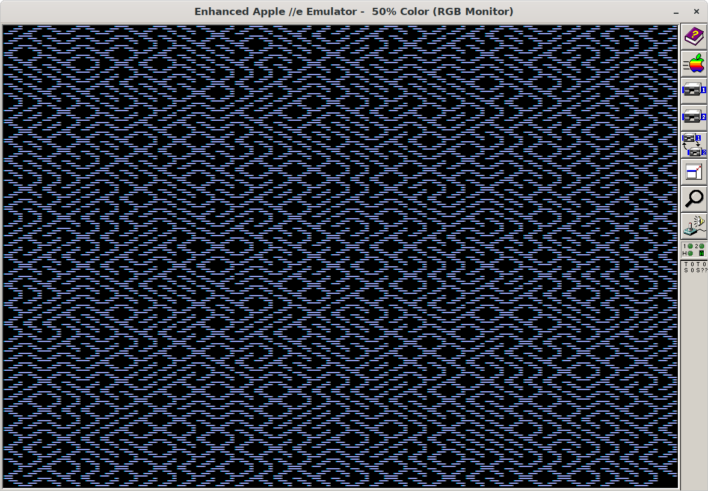

# maze
Draws a maze on the Apple IIe DHGR screen

# Instructions

## Windows Setup with Bundled AppleWin Emulator
1. Download the self-contained runnable zip [file](https://github.com/gungwald/maze/releases/download/v1.1.0/maze-runnable.zip).
2. Unzip it.
3. Double click the maze.bat file.

## Manual
1. Download and run [Applewin](https://github.com/AppleWin/AppleWin) or other Apple IIe emulator.
2. Insert maze.dsk into Drive 1.
3. Boot the emulator.

